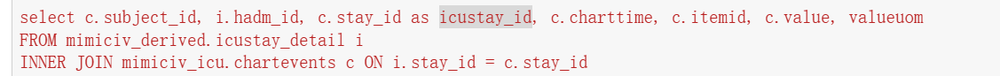
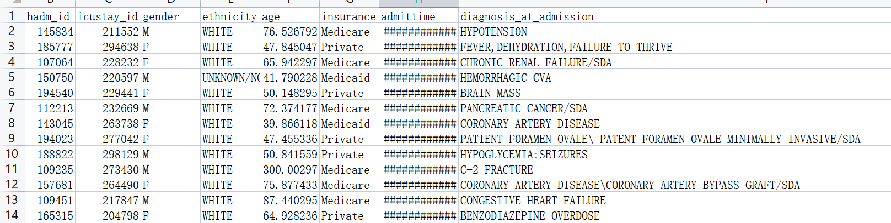
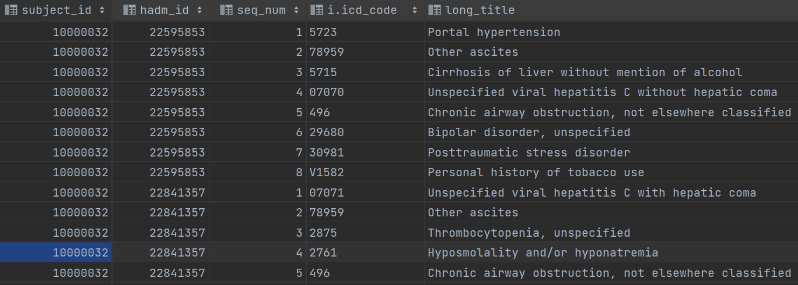
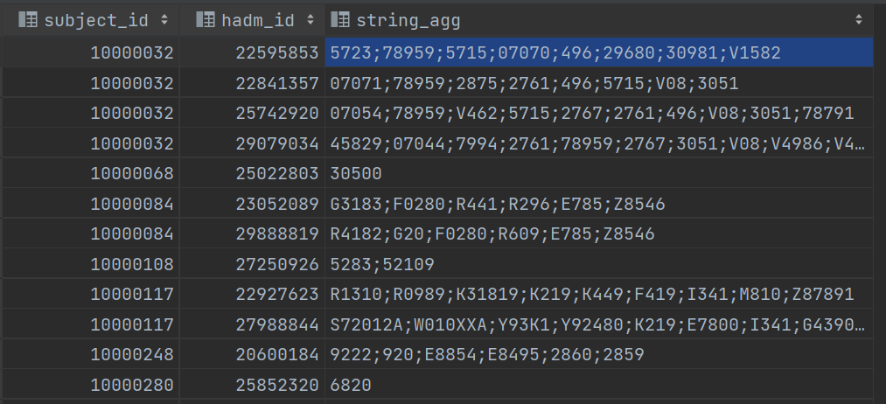
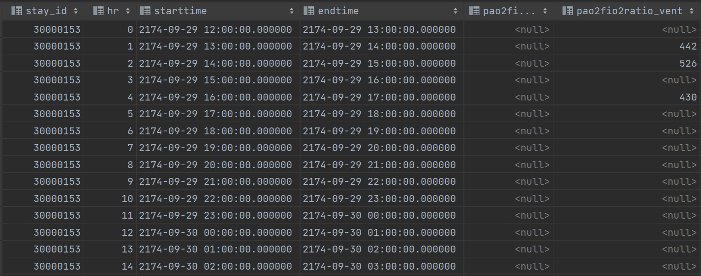
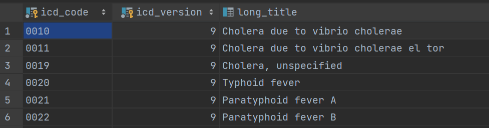
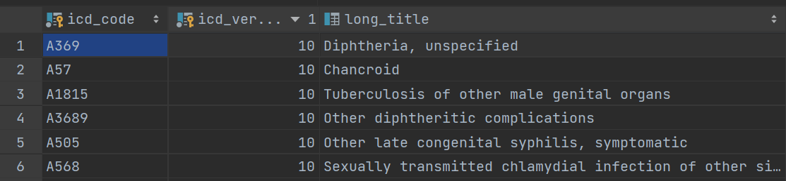
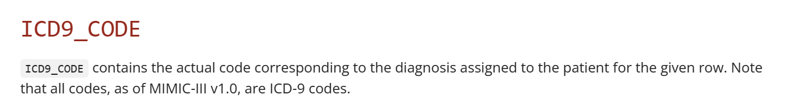

# MIMICIV_Extract

Next, you'll need to build 3 additional materialized views necessary for this pipeline. 

navigate to `utils`

`psql -U postgres -d mimiciv -f niv-durations.sql`.

`psql -U postgres -d mimiciv -f colloid_bolus.sql`.

`psql -U postgres -d mimiciv -f crystalloid_bolus.sql`.

`psql -U postgres -d mimiciv -f code_status.sql`.

`psql -U postgres -d mimiciv -f ccs_dx.sql`.

# Note

In MIMICIV, icustay_id is replaced by stay_id. Therefore, in order to reduce the conflict in MIMIC_Extract, stay_id have better to rename as icustay_id  after the query including stay_id

## static

#### diagnosis_at_admission  

diagnosis_at_admission  is one of the attributes of  deastatic_data.csv  in mimiciii, and every record of a hadm_id only obtain one specific diagnosis 

However, in mimiciv, each hadm_id can obtain a set of diagnosis

so we aggregate the icd_codes with separator(;)

But there are 21 hadm_id without the diagnosis record, so they are straightforward deleted. 

> missing hadm_id
>
> 29997616
> 29566607
> 24663747
> 28373841
> 23217565
> 24794357
> 21138323
> 28952159
> 26732997
> 26871621
> 27287088
> 23810242
> 26245807
> 26387132
> 25392033
> 24707962
> 23556381
> 22569393
> 23595518
> 29121879
> 25161730

### Sofa

in MIMICIV, the concept of sofa include the time series, for example:

So it is not suitable for static data, and I don't find it is used in further process. Therefore, I don't consider about sofa.

## X

in MIMICIII, there is only two datases which are  Metavision ICU databases and Carevue ICU databases. In contrast, only Metavision ICU database is used in MIMICIV. So, in many case, we have to modify the sql to handle this problem.

## Code extraction

In MIMICIV, there are two version icd are used. However, in MIMICIII, version 9 is only considered.

MIMICIV: d_icd_diagnoses table 

In MIMICIII, diagnoses_icd  table

## Note extraction

In MIMICIV, there is not table called noteevent, I guess that it may be replaced by mimiciv_note